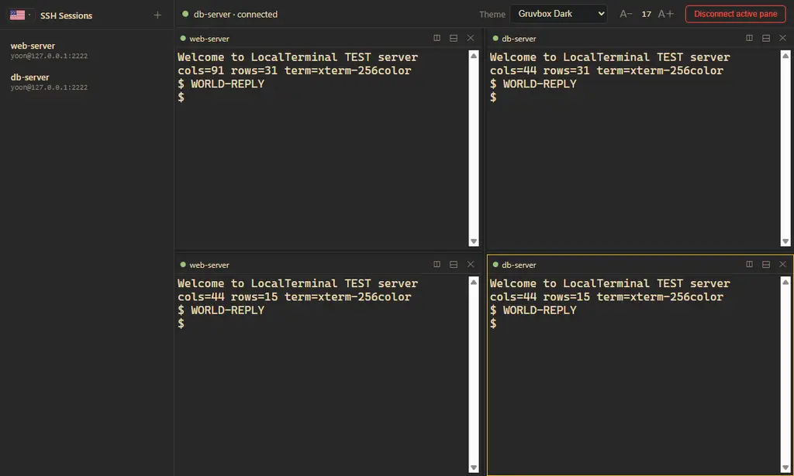

<div align="center">

# LocalTerminal

**Windows용 SSH 터미널 클라이언트** — 세션 저장 · 다중 동시 연결 · 자유 창 분할

Electron · xterm.js · ssh2

 

</div>

---



## ✨ 기능

### 세션 관리
- **더블클릭 즉시 접속** — 호스트·포트·사용자·인증 정보를 저장해 두고 사이드바에서 더블클릭하면 바로 셸이 뜹니다.
- **비밀번호 인증 / 개인 키 인증**(키 파일 브라우저 선택, 패스프레이즈 지원)
- 비밀번호·패스프레이즈는 **Windows DPAPI로 암호화**되어 디스크에 저장됩니다. 평문으로 남기지 않습니다.

### 다중 연결 & 창 분할
- 창 하나가 SSH 연결 하나. **여러 서버를 동시에** 붙잡을 수 있습니다.
- 창 헤더의 **◫ (오른쪽 분할) / ⊟ (아래 분할)** 로 tmux처럼 재귀적으로 쪼갭니다 — 2x2 그리드는 물론 어떤 배치든 가능.
- **스플리터 드래그**로 창 크기 비율 자유 조절 (PTY 크기도 실시간 반영).
- `Alt + 방향키`로 창 사이 이동, 창 제목 더블클릭으로 재연결.
- 세션 더블클릭 시 활성 창이 비어 있으면 그 창에, 사용 중이면 **오른쪽에 새 창**을 만들어 연결.

### 터미널
- **테마 12종** — Nord, Dracula, Tokyo Night, Catppuccin Mocha, Gruvbox Dark, One Dark, Monokai, Solarized Dark, Kanagawa, Everforest, Ayu Dark, Solarized Light. 터미널 16색과 UI 크롬이 일관되게 함께 바뀝니다.
- **글자 크기 8–32px** — 버튼, `Ctrl + = / - / 0`, `Ctrl + 휠` 어디서든 조절. 모든 창에 동시 적용.
- xterm-256color, 스크롤백 5,000줄, keepalive 유지.

## 🚀 설치 & 실행

### Release에서 받기
`dist/` 빌드 산출물 또는 GitHub Releases에서:
- **`LocalTerminal-Portable-1.0.0.exe`** — 단일 파일, 더블클릭 즉시 실행 (설치 불필요)
- **`LocalTerminal-Setup-1.0.0.exe`** — NSIS 설치판

### 소스에서 실행
```bash
npm install
npm start        # 개발 실행
npm run dist     # Windows exe 빌드 (portable + installer)
```

> Node.js 18+ 필요. 첫 실행 시 `npm install-scripts approve electron ssh2` 가 필요할 수 있습니다 (npm 12+ 의 설치 스크립트 승인 정책).

## ⌨️ 단축키

| 키 | 동작 |
|---|---|
| 세션 더블클릭 | 활성 창에 연결 (사용 중이면 오른쪽 새 창) |
| `Alt + ←/→/↑/↓` | 창 간 포커스 이동 |
| `Ctrl + =` / `Ctrl + -` / `Ctrl + 0` | 글자 크기 증가 / 감소 / 기본값 |
| `Ctrl + 휠` | 글자 크기 조절 |
| 창 제목 더블클릭 | 해당 창 세션 재연결 |

## 🔒 보안

- **자격증 저장**: Electron `safeStorage` → Windows DPAPI 기반 암호화 (`enc:` 접두사). 현재 Windows 사용자 계정에서만 복호화 가능.
- **프로세스 격리**: `contextIsolation: true`, `nodeIntegration: false`, 렌더러는 preload로 노출된 최소 API만 사용.
- **CSP** 적용 (`default-src 'self'`) — 외부 스크립트/네트워크 로드 차단.
- 비밀번호는 렌더러로 다시 전송되지 않습니다 (저장 여부 플래그만 전달).

## 🏗️ 구조

```
main.js      메인 프로세스 — 다중 SSH 연결 관리(connId 맵), 세션/설정 저장, DPAPI 암호화
preload.js   contextBridge — 렌더러에 노출되는 최소 IPC API
renderer/
  index.html 레이아웃 (사이드바 / 툴바 / 분할 영역)
  app.js     창 트리(재귀 분할), xterm 인스턴스 관리, 테마·폰트, 세션 UI
  style.css  테마 CSS 변수, 창·스플리터 스타일
test/
  sshd-test.js  로컬 테스트용 SSH 서버 (ssh2 서버 모드)
```

## 🧪 테스트

로컬 테스트 SSH 서버로 엔드투엔드 검증할 수 있습니다:

```bash
node test/sshd-test.js   # 127.0.0.1:2222 — testuser / testpass123
```

## 📄 라이선스

[MIT](LICENSE)
